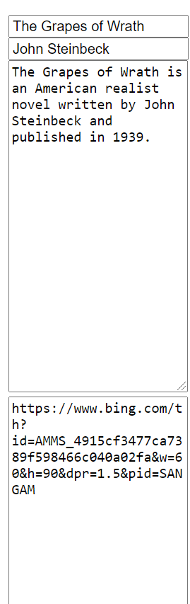
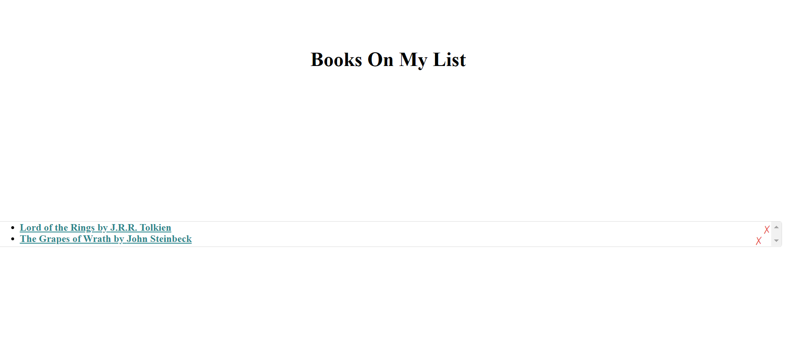

# Team-Profile-Generator

  ## Description
  Allows user to add books with name, author, image, description, and a link to the book, and then view their collection of books. The books will be saved until the user deletes it. Good for keeping track of what books the user should read and/or has read. 
  
  ## Table of Contents
  [Installation](#installation)
  [Usage](usage)
  [Tests](tests)
  [Contact Creator](contact-creator)
 
  ### Installation
  Node
  
  ### Usage
  Open application. Go to search page to add books, go to saved page to view and delete saved books. Fill out the form on the search page to add a book. The form requires a title and author in order to add a book. To add an image to the book, input a link to the image in the image input box. The description, image, and link are not required.

 
 

  #### GitHub Username
  [See GitHub](https://github.com/maxhanson07)

  #### Email Address
  mthanson2@gmail.com

  #### How to reach me
  Shoot me an email.